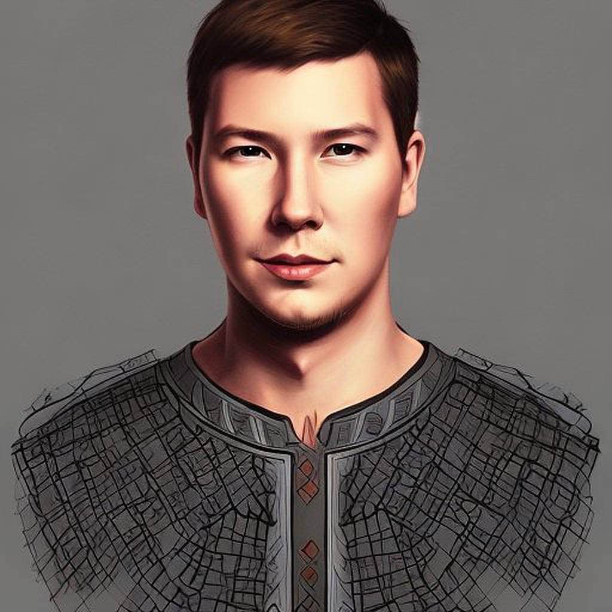

<html lang="ru">
  <head>
    <meta charset="utf-8">
      </head>
  <body>
     <header> <h1> Nikita Germanovich </h1>
    
    </header>
    <main>
    <section> 
      <ul>
        <li style="color:red"> Age: 27 </li>
        <li style="color:red"> Education Degree: Higher </li>
        <li style="color:red"> Direction: IT </li>
        <li style="color:red"> Country: Uzbekistan </li>
      </ul>
    </section>
    <section>
      <h2> Education </h2>
      Tashkent University of Information Technology
        2012 - 2016  
    </section>
        <section>
      <h2> Experience </h2>
           FV "JS Developers" 
            2020 - until now  
    </section>
    <section>
      <h2> Contacts </h2>
          tel: +99890 7770912
        email: azbuka@gmail.com  
          </section>
    </main>
    <footer>
    <section>
         <a href="https://github.com/nikitamobile/"> nikitamobile GitHub <a>  
         </section>
         <section>
         
              </section>
             </footer>
  </body>
</html>

